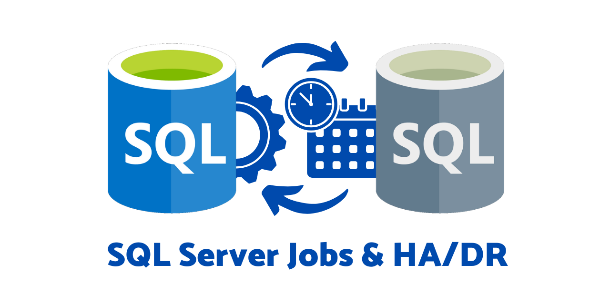

# SQL Server Jobs & HA/DR

This repository contains solutions to properly control and maintain **scheduled jobs on SQL Servers** with either **Availability Groups** or **Database Mirroring**.

This solution is an improved version of the scripts provided at [Automatically Enable or Disable Jobs Based on HADR Role](https://eitanblumin.com/2018/11/06/automatically-enable-or-disable-jobs-based-on-hadr-role/).

## Availability Groups

The relevant scripts for Availability Groups are provided in the [availability-groups folder](availability-groups/).

- [AlwaysOn - Master Control Job and Alert.sql](availability-groups/AlwaysOn%20-%20Master%20Control%20Job%20and%20Alert.sql)

## Database Mirroring

The relevant scripts for Database Mirroring are provided in the [database-mirroring folder](database-mirroring/).

- [DB Mirroring - Master Control Job and Alert.sql](database-mirroring/DB%20Mirroring%20-%20Master%20Control%20Job%20and%20Alert.sql)

## Classic Version

This repository also contains the "classic" versions of the scripts, provided in the [classic folder](classic/).

- [ChangeJobStatusBasedOnHADR.sql](classic/ChangeJobStatusBasedOnHADR.sql)
- [ChangeJobStatusBasedOnMirroring.sql](classic/ChangeJobStatusBasedOnMirroring.sql)

## License

This solution is released under the [MIT License](LICENSE), and is provided "as-is", as a free contribution to the professional SQL Server community.

## Contribution

This is an open-source solution. Please feel free to [create issues]({{ site.github.repository_url }}/issues) if you want to submit bug reports or feature requests.

You may also **fork** the solution to your account and submit pull requests if you want to contribute!
